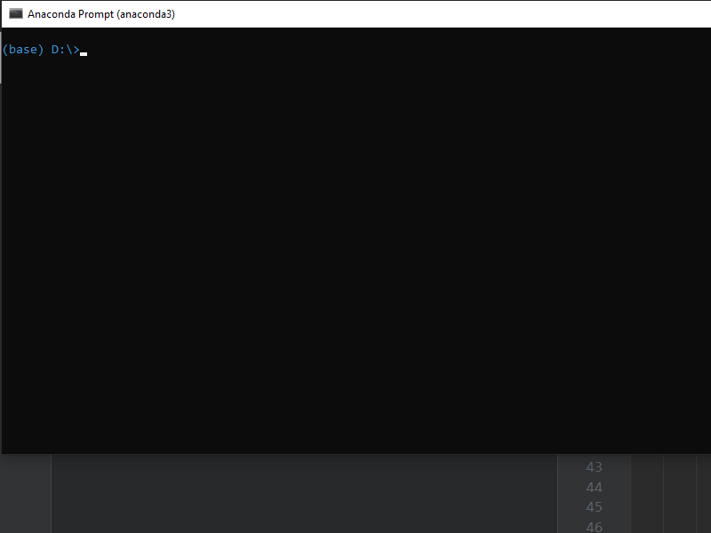

# Reverse

The user is presented with a sequence of numbers from 1 to 9, the aim of 
the game is to arrange the numbers in 123456789 sequence 
in as short moves as possible.


## How to start
After intallation, in cmd type ``revgame``

```bash
revgame
```


# Install
pip install reverse


# Demo


